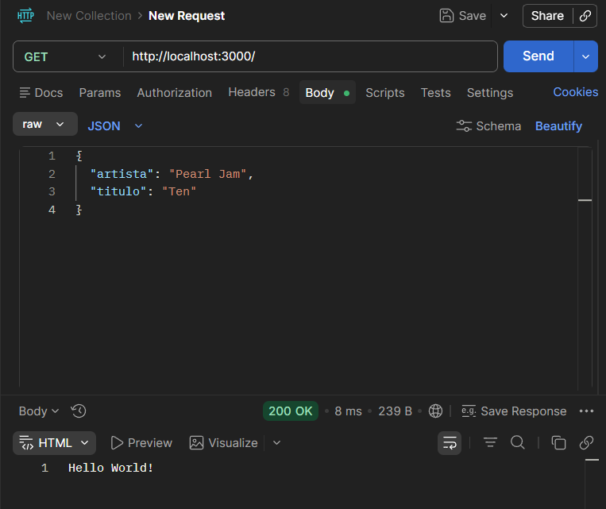
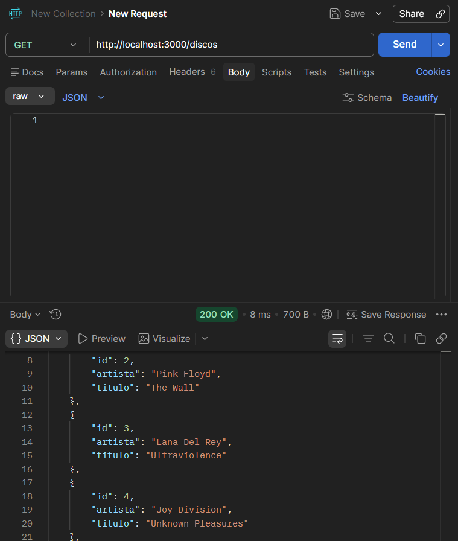
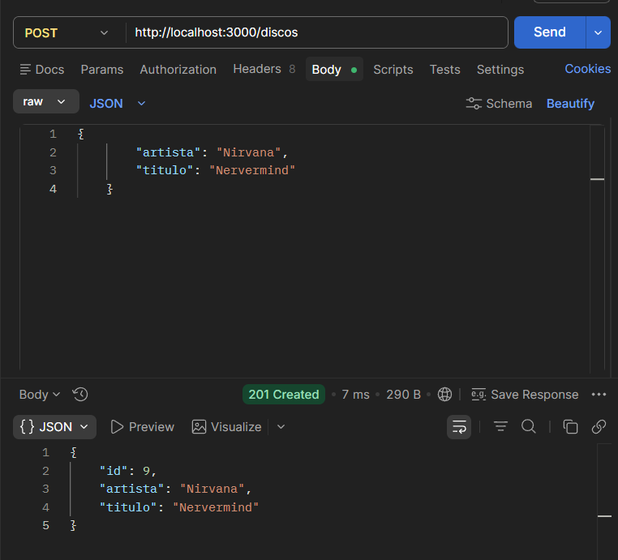
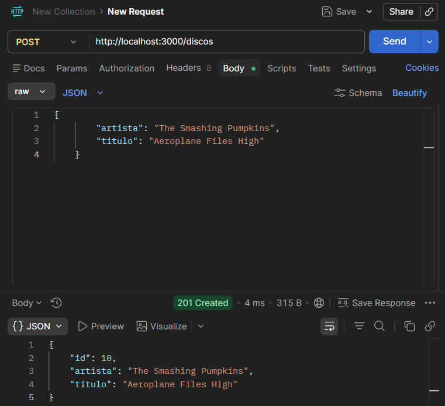
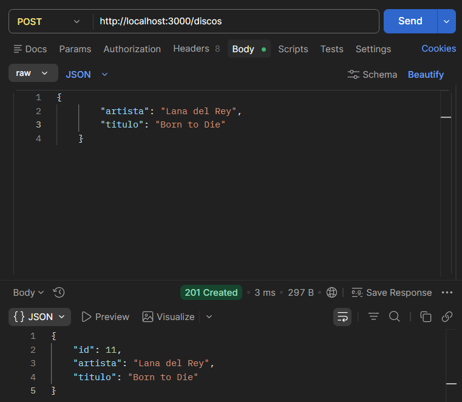
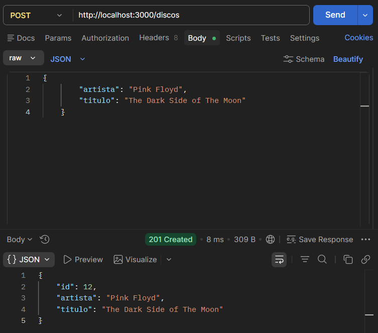
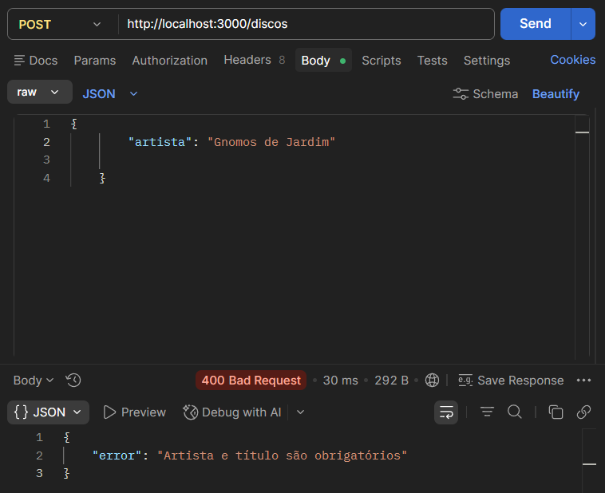

# API de Discos

## Descrição

API simples desenvolvida com Express para gerenciamento de discos musicais.

---

## Como executar o projeto

```bash
npm install
node server.js
```

Servidor rodando em:

```
http://localhost:3000
```

---

## Endpoints

### * GET /

* **Descrição:** Retorna mensagem de teste
* **URL:** `/`
* **Método:** GET
* **Body:** Não possui

#### Resposta:

```json
"Hello World!"
```

#### Exemplo no Postman:



---

### * GET /discos

* **Descrição:** Retorna lista de discos
* **URL:** `/discos`
* **Método:** GET
* **Body:** Não possui

#### Resposta:

```json
[
  {
    "id": 1,
    "artista": "Radiohead",
    "titulo": "In Rainbows"
  }
]
```

#### Exemplo no Postman:



---

### * POST /discos

* **Descrição:** Adiciona um novo disco
* **URL:** `/discos`
* **Método:** POST
* **Body:** JSON obrigatório

#### Exemplo de requisição:

```json
{
  "artista": "Pearl Jam",
  "titulo": "Ten"
}
```

#### Resposta (201 Created):

```json
{
  "id": 8,
  "artista": "Pearl Jam",
  "titulo": "Ten"
}
```

#### Resposta de erro (400 Bad Request):

```json
{
  "error": "Artista e título são obrigatórios"
}
```

#### Exemplo no Postman:

 * 1


 * 2


 * 3


 * 4


 * 5 (erro)


---

## Validações Implementadas:

A API possui validação básica no endpoint de criação de discos:

```js
if (!req.body.artista || !req.body.titulo) {
    return res.status(400).json({ error: "Artista e título são obrigatórios" });
}
```

### que essa validação faz:

* Garante que o campo **artista** seja enviado
* Garante que o campo **titulo** seja enviado
* Impede inserção de dados incompletos
* Retorna erro **400 Bad Request** caso falhe

### Importância:

Essa validação evita inconsistências no sistema e garante que todos os discos cadastrados tenham as informações mínimas necessárias.

---

## Observações:

* Os dados são armazenados em memória (array), ou seja:

  * Ao reiniciar o servidor, os dados são resetados
* IDs são gerados automaticamente com base no tamanho do array

---

## Autora:

Projeto desenvolvido por Sofia Medeiros da Fonseca para fins de estudo com Node.js e Express.
